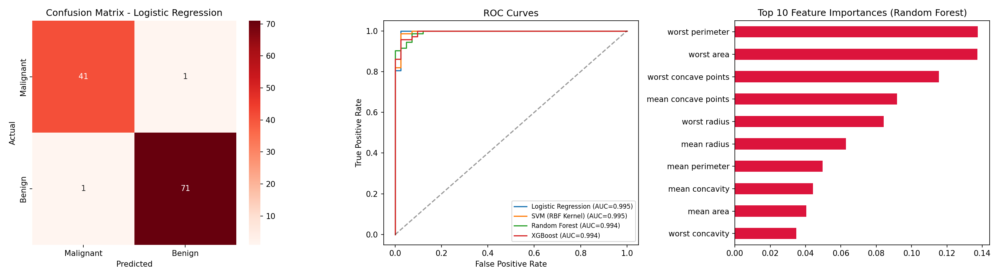

# CodeAlpha_DiseasePrediction

## 📌 Task 4: Disease Prediction from Medical Data
**CodeAlpha Machine Learning Internship**

### 🎯 Objective
Predict the possibility of disease (malignant vs. benign tumor) based on
patient diagnostic measurements.

### 🛠 Approach
- Used the **Breast Cancer Wisconsin (Diagnostic) Dataset** — a real,
  well-known medical dataset from the UCI ML Repository (bundled with
  scikit-learn), containing 30 diagnostic features (cell nuclei
  measurements: radius, texture, perimeter, concavity, etc.) for 569
  patients.
- Trained and compared four classification algorithms:
  - Logistic Regression
  - SVM (RBF Kernel)
  - Random Forest
  - XGBoost
- Evaluated with Precision, Recall, F1-Score, and ROC-AUC (critical in
  medical diagnosis, where false negatives are costly).

### 📊 Results

| Model               | Accuracy | Precision | Recall | F1-Score | ROC-AUC |
|---------------------|----------|-----------|--------|----------|---------|
| Logistic Regression | 0.9825   | 0.9861    | 0.9861 | 0.9861   | 0.9954  |
| SVM (RBF Kernel)     | 0.9825   | 0.9861    | 0.9861 | 0.9861   | 0.9950  |
| XGBoost             | 0.9474   | 0.9459    | 0.9722 | 0.9589   | 0.9940  |
| Random Forest       | 0.9474   | 0.9583    | 0.9583 | 0.9583   | 0.9937  |

**Best Model: Logistic Regression** (98.25% accuracy, ROC-AUC 0.9954)



### 🗂 Files
- `disease_prediction.py` — full training & evaluation pipeline
- `breast_cancer_features.csv` — dataset features used
- `model_comparison_results.csv` — metric comparison table
- `disease_prediction_results.png` — confusion matrix, ROC curves, feature importance
- `disease_prediction_best_model.pkl` — saved trained model
- `scaler.pkl` — saved StandardScaler

### ▶️ How to Run
```bash
pip install numpy pandas scikit-learn xgboost matplotlib seaborn joblib
python disease_prediction.py
```

### 🧠 Key Learnings
- Simpler linear models (Logistic Regression) can outperform more complex
  ensemble methods when features are well-scaled and linearly separable —
  more complex isn't always better.
- ROC-AUC above 0.99 across all models shows this dataset has very strong
  predictive signal in its diagnostic features.
- Feature importance analysis shows "worst" (largest) cell measurements
  are the strongest predictors of malignancy.

---
**Author:** Shrey Patel
**Internship:** Machine Learning Intern @ CodeAlpha
